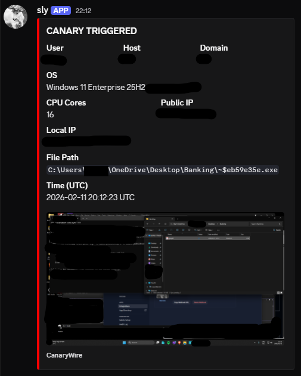

# CanaryWire

Honeytoken file deployer and intrusion monitor for Windows.


<p align="center">
  
</p>

CanaryWire creates disguised canary files that alert you via Discord the instant they are opened. It deploys a file that appears as a normal `.pdf` in Windows Explorer — complete with an Adobe Acrobat icon and no visible executable extension. When opened, the canary silently captures system intelligence, takes a screenshot, and sends a formatted embed alert to your Discord webhook.

> **Use only on systems you are authorized to test. Unauthorized deployment is illegal.**

## Key Features

*   **Invisible Extension:** Uses the Windows Shortcut (`.lnk`) method. Windows never displays the `.lnk` extension — this is hardcoded in the OS shell and unaffected by "Show file extensions".
*   **Adobe Acrobat Disguise:** Embedded icon, spoofed assembly metadata (Product, Company, Version). The canary looks and behaves like a real PDF.
*   **Hidden Payload:** The executable is deployed with `Hidden + System` file attributes, invisible in default Explorer views.
*   **Screenshot Capture:** Captures the primary screen at the moment of opening and attaches it to the Discord alert.
*   **Accurate OS Detection:** Reads the Windows registry to report the correct edition and version (e.g. `Windows 11 Enterprise 24H2`), not the generic `NT 10.0.x` string.
*   **Discord Embeds:** Alerts are sent as structured Discord embeds with inline fields and a red severity bar.
*   **Stealth:** Fails silently on error. No console windows, no visible processes.

## How It Works

Windows shortcuts (`.lnk`) have a unique property: the OS **never** displays their extension. Unlike every other file type, `.lnk` is exempt from the "Show file extensions" setting. This makes it the only reliable method for completely hiding a file's true nature.

CanaryWire deploys three files to the target directory. Only the shortcut is visible:

| File | Visible? | Purpose |
|---|---|---|
| `name.pdf` | Yes | `.lnk` shortcut with Adobe Acrobat icon |
| `~$xxxxxxxx.exe` | No | The canary payload (Hidden + System) |
| `~$xxxxxxxx.ico` | No | Adobe icon file (Hidden + System) |

When the shortcut is opened:

1. The hidden `.exe` launches silently
2. Extracts the webhook URL from its own binary tail
3. Captures a screenshot of the user's screen
4. Gathers system intelligence (user, host, IPs, OS, file path)
5. Sends a formatted Discord embed with the screenshot attached
6. Displays a fake "Adobe Acrobat Reader" damaged-file error dialog

## What It Captures

| Field | Description |
|---|---|
| User | Windows username |
| Host | Machine hostname |
| Domain | Domain or workgroup |
| OS | Full edition, version, and build from registry |
| CPU Cores | Processor count |
| Public IP | External IP via `api.ipify.org` |
| Local IP | All active local network addresses |
| File Path | Full path the canary was executed from |
| Screenshot | Primary monitor capture at time of opening |
| Timestamp | UTC time of execution |

## Prerequisites

| Requirement | Details |
|---|---|
| Windows | 10 / 11 |
| .NET 10 Desktop Runtime | [Download here](https://dotnet.microsoft.com/download/dotnet/10.0) — required for both the deployer and the canary payload |

> Building from source requires the [.NET 10 SDK](https://dotnet.microsoft.com/download/dotnet/10.0) instead of just the runtime.

## Quick Start

### Option A: Download Release

1. Install the [.NET 10 Desktop Runtime](https://dotnet.microsoft.com/download/dotnet/10.0) if you don't have it
2. Download the latest `.zip` from [Releases](../../releases)
3. Extract all files into the same folder
4. Double-click `CanaryWire.CLI.exe`

The release zip contains everything you need:

| File | Purpose |
|---|---|
| `CanaryWire.CLI.exe` | The deployer — **run this** |
| `CanaryWire.CLI.dll` | Deployer managed code (loaded automatically) |
| `CanaryWire.CLI.deps.json` | Runtime dependency manifest |
| `CanaryWire.CLI.runtimeconfig.json` | Framework target config |
| `CanaryWire.Canary.exe` | Payload template (detected automatically by the deployer) |
| `image.png` | Adobe Acrobat icon source (detected automatically by the deployer) |

> **Keep all files in the same folder.** The deployer looks for `CanaryWire.Canary.exe` and `image.png` next to itself.

### Option B: Build from Source

```bash
git clone https://github.com/YOUR_USERNAME/CanaryWire.git
cd CanaryWire
dotnet publish CanaryWire.Canary -c Release -r win-x64 --self-contained false -p:PublishSingleFile=true
dotnet run --project CanaryWire.CLI
```

### Follow the Prompts

```
=== CanaryWire Deployer ===

[*] Found payload template: ...\publish\CanaryWire.Canary.exe
[*] Found icon source: ...\image.png

Enter Discord Webhook URL: https://discord.com/api/webhooks/...
Enter canary name (e.g. 'passwords', 'confidential'): payroll
Enter output directory (full path, e.g. 'C:\Users\you\Desktop'): C:\Users\target\Desktop\Finance

[+] Canary deployed successfully!

    Shortcut : C:\Users\target\Desktop\Finance\payroll.pdf.lnk
               Displayed as "payroll.pdf" (.lnk is always hidden)
    Payload  : C:\Users\target\Desktop\Finance\~$a1b2c3d4.exe
               Hidden + System (invisible in Explorer)
    Icon     : C:\Users\target\Desktop\Finance\~$a1b2c3d4.ico
               Hidden + System (invisible in Explorer)

[!] Deploy ALL generated files together to the target location.
    Only the .pdf shortcut is visible to the target user.
```

## Architecture

```
CanaryWire.CLI (Deployer)
├── Finds published payload template
├── Embeds webhook URL into binary tail
├── Generates ICO from PNG (PNG-in-ICO format)
├── Deploys hidden .exe + .ico (Hidden + System)
└── Creates .lnk shortcut with Adobe icon

CanaryWire.Canary (Payload)
├── Extracts webhook URL from own binary tail
├── Captures screenshot (primary monitor)
├── Gathers system intel (registry-based OS, IPs, path)
├── POSTs Discord embed with screenshot attachment
└── Shows fake Adobe Acrobat error dialog
```

## Disclaimer

This tool is for authorized security testing and defensive auditing only. It is designed to detect unauthorized access to sensitive files and directories. Misuse is the sole responsibility of the user.

## License

MIT
